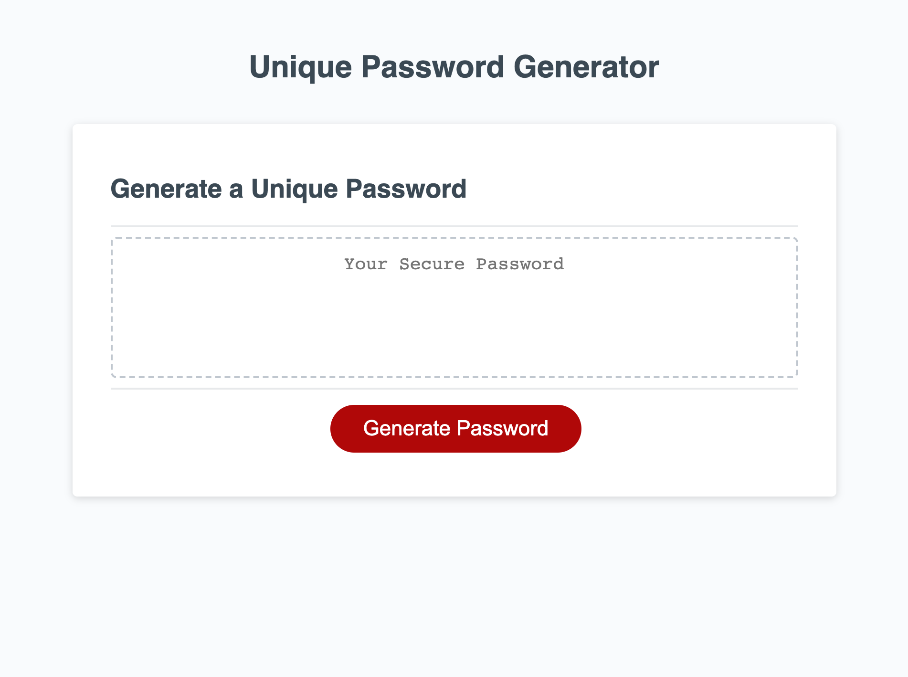

# Unique-Password-Generator

## Description
- Provided with a starter code to the password generator I started to work on the JavaScript file to fill in the parts to meet the acceptance criteria. This password generator will take in user inputs via window prompts for specifics about the password they would like to generate. It will ask the length of the password from 8 to 128 characters and provide an alert if the input received is outside of the range provided. It will also ask what types of characters the user would like to have included in their password from lowercase and upper case letters, special characters and numbers. It will also provide an alert if the user does choose at least one type of character to include.

## Live URL

## Resources Used on Project
1. Password Special Characters: https://owasp.org/www-community/password-special-characters
2. Mini Project - Rock, Paper, Scissors
3. MDN Web Docs - JavaScript

## Contributors
1. caballero-r
2. Xandromus
3. shanelbb